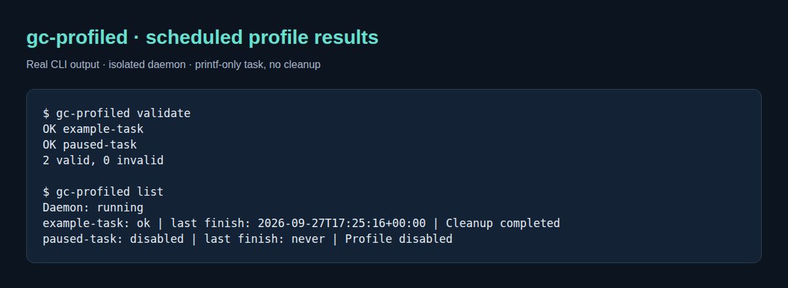

# gc-profiled

Run your cleanup scripts on a schedule and report their results.
Python 3.11+ on Linux; no third-party Python dependencies.

- One TOML profile defines a command, interval and timeout.
- Up to four profiles run together; a profile never overlaps itself.
- Status and rotating logs record success, failure and interrupted runs.
- Login HUD can read the status; it does not start cleanup jobs.

The daemon does not decide what to delete. Cleanup policy belongs in your scripts.



This capture uses a temporary daemon, a command that only prints text, and a
disabled profile. It does not run cleanup on real files.

## Install

```sh
make check
python3 scripts/install.py --enable
```

The installer copies the runtime and enables a systemd user service. It creates
no enabled cleanup profiles. Re-run it to update the installed copy.

## Profiles

Start with the disabled [example profile](examples/build-cache.toml). Copy it to
`~/.config/gc-profiled/profiles/`, set your command and working directory, and
validate it before enabling it.

Commands use an argument array without an implicit shell. Executable and working
directory paths must be absolute (`~/` is supported). A newly enabled profile
runs immediately; later runs are scheduled from the previous finish time.

```sh
gc-profiled validate
gc-profiled list
gc-profiled status
gc-profiled logs build-cache

# Stop scheduling and terminate active jobs.
systemctl --user disable --now gc-profiled.service
```

`gc-profiled run NAME` queues an enabled profile; it does not wait for completion.
Keep real profiles and logs private. An old successful result does not prove the
daemon is still running: check its heartbeat and service status.

## Documentation

- [Safe first run and troubleshooting](docs/usage.md) · [Profile and status reference](docs/reference.md)
- [Architecture](docs/architecture.md) · [PlantUML source](docs/architecture.puml)
- [Releases](https://github.com/Sage-Cat/gc-profiled/releases) · [Publication process](https://github.com/Sage-Cat/workspace-state/blob/main/docs/publication.md)
