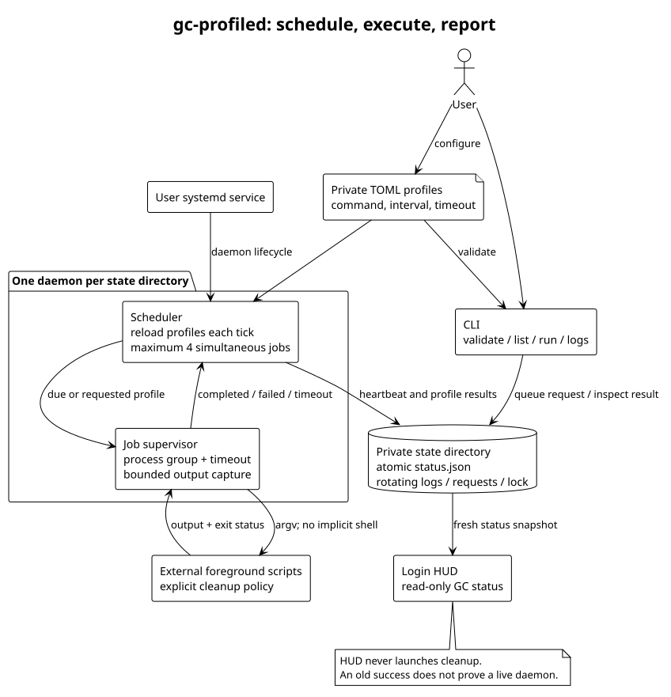

# Architecture

[Overview](../README.md) · [Safe first run](usage.md) · [PlantUML source](architecture.puml)

One daemon owns one state directory through an exclusive lock. It reloads private
TOML profiles on each scheduler tick, reaps completed jobs, consumes manual
requests, starts eligible jobs within the concurrency limit, and atomically
publishes a fresh status snapshot. Cleanup decisions remain in external scripts.

| Boundary | Contract |
|---|---|
| Profile → scheduler | Validated command argument array, absolute working directory, interval, timeout and environment. Unknown fields fail validation. |
| Scheduler → script | Foreground process under the daemon's user, in its own process group; no implicit shell or privilege switching. |
| Script → supervisor | Merged stdout/stderr and exit code; zero means success. Timeouts and daemon shutdown terminate the process group. |
| Scheduler → readers | Atomic schema-versioned `status.json`, timestamps, profile results and daemon heartbeat. |
| CLI → daemon | A request file queues an enabled profile; acknowledgment is not completion. |
| State → HUD | Read-only presentation. The HUD cannot start cleanup through this integration. |

The main implementation is [`gc_profiled.py`](../gc_profiled.py). `read_profile`
validates configuration, `Daemon.tick` schedules work, `Daemon.reap` handles
completion and timeouts, and `atomic_json` publishes snapshots. The
[installer](../scripts/install.py) copies runtime files and creates a user service.

An enabled profile without a prior finish time runs immediately. Subsequent runs
are scheduled relative to its last finish, including failures; overdue work runs
once after downtime. Up to four profiles run concurrently, and a profile never
overlaps itself. A changed profile affects future execution, not a process already
running. Interrupted runs become failures after restart.

State and rotating logs are private to the daemon user. The snapshot is the
integration interface; readers should not infer scheduler health from old green
profile rows. A heartbeat older than 30 seconds is unavailable. Logs may include
sensitive script output and are not part of source or release artifacts.

The design deliberately has no built-in deletion rules, cron calendar, detached
background jobs, or privileged execution broker. Scripts must implement and test
their own retention policy and return a failure exit code when work fails.
